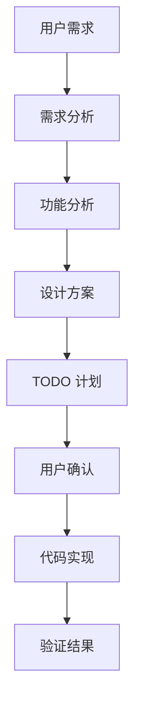

# Spec Coding 软件工程流程规范

## 0. 全局生效声明

本规范中的所有规则均设置为全局生效规则，适用于后续所有 coding、debug、refactor、test、script、docs 相关实现任务。

除非用户明确提出新的覆盖性规则，否则本规范优先作为后续任务的默认执行约束。

## 1. 目的

本规范用于约束后续所有 coding 类任务的执行流程，确保在代码修改、重构、修复、功能开发之前，先完成需求理解、影响分析、方案设计和执行计划，避免直接进入实现导致范围不清、设计不充分或引入回归问题。

## 2. 适用范围

适用于本项目中的以下类型任务：

- 新功能开发
- Bug 修复
- 架构调整
- 文件结构重组
- API 修改
- 数据库变更
- 依赖升级
- 性能优化
- 测试补充
- 脚本和部署流程调整

## 3. 强制前置流程

任何 coding 执行之前，必须先完成以下步骤。

### 3.1 需求理解

输出内容：

- 用户原始诉求复述
- 目标结果
- 非目标范围
- 已知约束
- 需要澄清的问题

### 3.2 现状分析

输出内容：

- 当前项目结构或相关模块现状
- 涉及文件和模块
- 当前实现方式
- 潜在风险点
- 与现有代码的依赖关系

### 3.3 功能分析

输出内容：

- 功能边界
- 输入输出
- 主要流程
- 异常场景
- 兼容性要求
- 安全性和权限影响
- 数据一致性影响

### 3.4 设计方案

输出内容：

- 推荐方案
- 备选方案
- 方案取舍理由
- 模块划分
- 数据流或调用流
- 必要时提供 Mermaid 图

### 3.5 执行计划

输出内容：

- 明确、可执行的 TODO 列表
- 每个 TODO 聚焦一个单一结果
- 按执行顺序排列
- 标记哪些步骤需要用户确认
- 不输出工时估算

### 3.6 用户确认

在进入 coding 前，必须询问用户是否认可计划，或是否需要调整。

未经用户确认，不进入代码修改阶段。

### 3.7 特别规则

以下特别规则具有优先级：

1. 如果用户明确声明“不需要执行 spec coding 规划”或表达同等含义，则不需要输出完整需求规划、功能分析和完整设计文档，只需确认执行步骤，并输出简版设计。
2. 如果用户提供或引用了设计文档，则以该设计文档为准执行；若设计文档与用户当前指令冲突，应优先确认冲突点，再继续执行。

## 4. Coding 阶段要求

进入 coding 阶段后，必须遵守：

- 按已确认 TODO 顺序执行
- 每次修改前确认目标文件和影响范围
- 优先做最小必要修改
- 修改后执行可用的编译、测试或静态检查
- 若发现新风险，暂停并更新计划
- 完成后输出变更摘要和验证结果

## 5. 输出模板

### 5.1 需求规划模板

```markdown
## 需求规划

### 用户诉求

### 目标结果

### 非目标范围

### 约束条件

### 待确认问题
```

### 5.2 功能分析模板

```markdown
## 功能分析

### 涉及模块

### 输入输出

### 主流程

### 异常流程

### 风险分析
```

### 5.3 设计文档模板

```markdown
## 设计方案

### 推荐方案

### 备选方案

### 方案取舍

### 模块关系

### 数据流

### 验证策略
```

### 5.4 TODO 模板

```markdown
- [ ] 分析现有实现和依赖关系
- [ ] 明确修改边界和风险点
- [ ] 设计目标方案
- [ ] 等待用户确认方案
- [ ] 切换到 Code 模式实现
- [ ] 执行验证
- [ ] 输出结果摘要
```

## 6. Mermaid 图规范

如需输出 Mermaid 图，需避免在方括号内使用双引号和括号，降低解析失败概率。

推荐格式：



## 7. 后续执行原则

后续所有 coding 请求均默认执行以下策略：

1. 先进入规划分析。
2. 输出需求规划、功能分析、设计方案和 TODO。
3. 请求用户确认。
4. 用户确认后再切换到 Code 模式。
5. 实现完成后执行验证并输出结果。

例外情况：

1. 用户明确声明不需要执行 spec coding 规划时，执行简化流程：确认执行步骤、输出简版设计、等待确认后实施。
2. 用户提供或引用设计文档时，以设计文档为准组织需求分析、方案设计、TODO 和后续实现。

## 8. 当前约定状态

本规范作为当前项目后续 coding 能力的全局前置要求执行。

全局生效范围包括：

- 需求分析
- 功能设计
- 代码实现
- Bug 修复
- 架构重构
- 测试补充
- 脚本调整
- 文档变更
- 编译验证
- 运行验证

全局优先级规则：

1. 用户明确声明不需要执行 spec coding 规划时，执行简化流程。
2. 用户提供或引用设计文档时，以设计文档为准执行。
3. 若当前指令、设计文档和既有规范存在冲突，应先确认冲突点，再继续执行。
